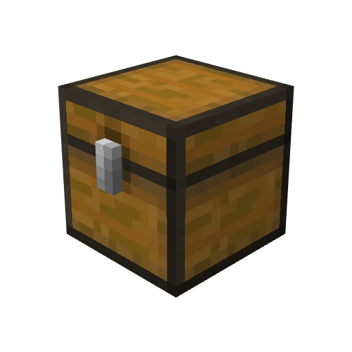

<h1 align="center">
  <br/>
  Minecraft Pack Environment 📦
</h1>

A development environment and template designed to automate the packaging process for Minecraft resource packs and data packs.

## 🔗 Dependencies

This repository uses [Nix](https://nixos.org) to provide a consistent development environment via `nix-shell` with all the necessary tools.

> [!WARNING]
> Nix is natively supported only on Unix-like operating systems (Linux and macOS). Windows users can use it via WSL2 (Windows Subsystem for Linux).

### ✍️ Manual Installation (Alternative)
If you prefer not to use Nix, or if you are on a system that doesn't support it, you can install all the required tools manually. You will need:

* [GNU Make](https://ftp.gnu.org/gnu/make/) – For automating the packaging process.
* [minizip-ng](https://github.com/zlib-ng/minizip-ng) – For packaging of zip archives.
* [yq](https://github.com/mikefarah/yq) – For parsing TOML.

## 🛠️ Packaging

> [!TIP]
> 📁 [`src/`](src/) – Contains the source files of the pack.
>
> 📦 [`packs/`](packs/) – Contains final, ready-to-use packs.

1. **Enter the Nix environment:**
   Open your terminal in the root directory of the repository and run:
   ```bash
   nix-shell
   ```
   *This will automatically download and install all necessary tools.*

2. **Build the pack:**
   Inside the Nix shell, run the following command to package:
   ```bash
   make
   ```

## 📄 License & Ownership

This repository is licensed under the [MIT License](LICENSE). 

* **The Environment:** This **license applies** strictly to the automation scripts and configurations provided by the author.
* **Your Content:** This **license does not apply** to any resource packs, data packs, textures, or models that you create. Everything you add for your packs belongs entirely to you. You are free to distribute your packs under any license you choose.
